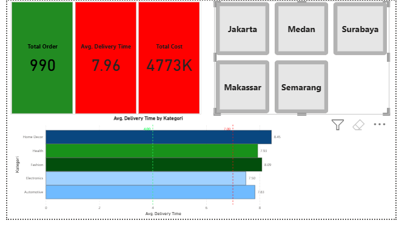
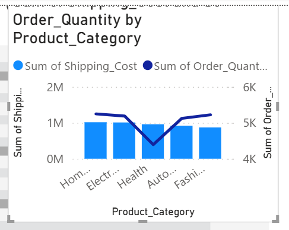
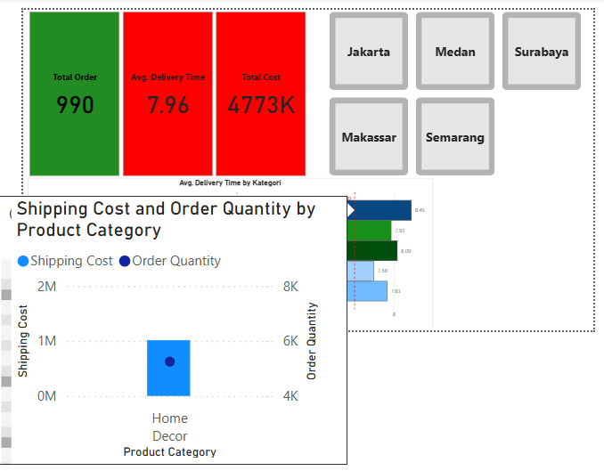
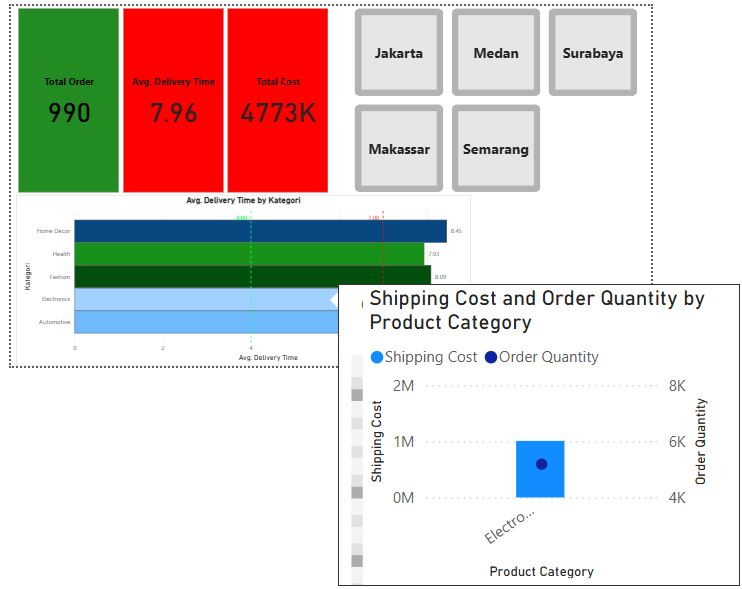

📝 Conclusion & Analysis Limitations

Meskipun dashboard ini berhasil memvisualisasikan metrik operasional secara interaktif, terdapat beberapa temuan penting terkait karakteristik data:

    Data Anomaly: Terdapat ketidakseimbangan skala yang ekstrem antara biaya pengiriman (Shipping Cost) dan jumlah pesanan (Order Quantity). Sebagai contoh, biaya pengiriman bisa mencapai $1M sementara jumlah pesanan sangat rendah (mendekati 0).

    Synthetic Dataset: Analisis ini dilakukan pada dataset sintetis yang dihasilkan secara terprogram. Oleh karena itu, data ini tidak merepresentasikan logika bisnis riil atau pola transaksi dunia nyata secara utuh.

    Root Cause Limitation: Dikarenakan sifat datanya yang sintetis dan memiliki sebaran yang terlalu merata (berdasarkan df.describe), terdapat batasan dalam menentukan akar penyebab (root cause) dari anomali yang ditemukan secara definitif.

## Dashboard and Tooltip Preview

